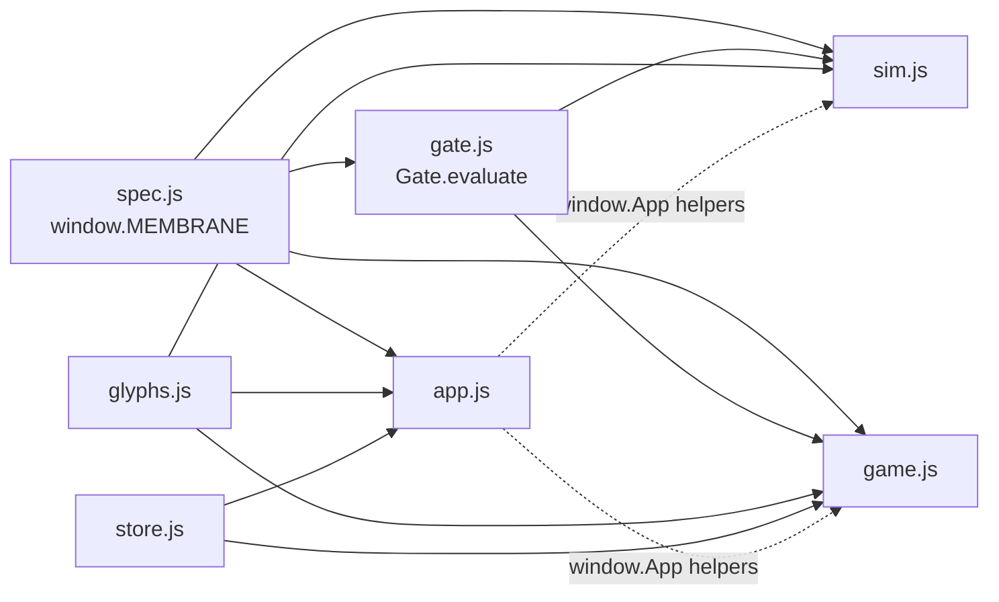
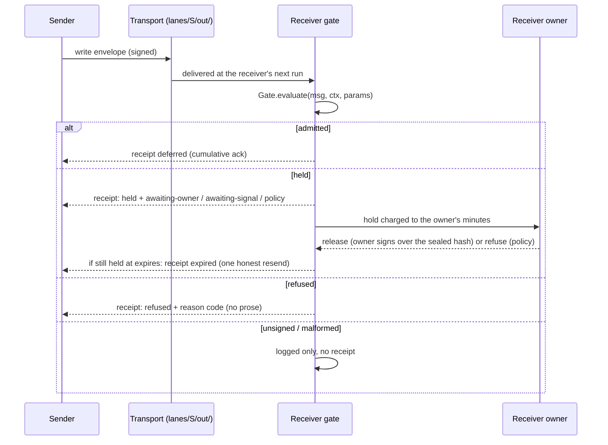

# ARCH.md: the contract between modules

*Draft for `membrane-playground`, contract **0.3-draft** (`spec.js`: `version: "0.3-draft"`, `date: "2026-09-14"`), written against commit `2ca3d45`. `gate.js` and `game.js` cite this file ("Order follows ARCH.md 'Gate contract'", "Code against the Gate contract in ARCH.md"), but it was not in the export. Everything below comes from the repository text. Items marked *Confirm* are readings only the author can settle; items marked *Proposed* are suggestions, not repo text.*

*Provenance: drafted by brobber from reading the repository, and added to it on 3 Oct 2026. "We", "ours" and "a private project of ours" below are brobber's side speaking, not the repository's owners. One example tied to a single vendor was made general on the way in. The four breaking rules it mentions have since been adopted, so `MEMBRANE.params` has nineteen knobs and every scenario names a break.*

---

## 1. Ground rules

1. **`spec.js` is the single source of truth.** `window.MEMBRANE` holds every field name, enum value, reason code, parameter, scenario, challenge and decision. The README ("Layout") says no view hardcodes any of them. Read as text, a few do: `game.js` hardcodes the `STRICT` label and the impact and reach lists, `glyphs.js` hardcodes the disposition names (`DISPOSITION_VAR`), and `sim.js` hardcodes a disposition list (`DISP`). *(Confirm: move these into `spec.js`, or narrow the rule to "the contract data lives in `spec.js`".)*
2. **The gate reads only its arguments.** `Gate.evaluate(msg, ctx, params)` is pure and synchronous: no DOM, no clock, no randomness. The time comes from `ctx.now`. The simulation, the game and any future implementation share it, so they can be checked against each other.
3. **Every decision cites a spec item.** Every gate step carries `ref` (a `spec.js` item id). Every contract item carries `refs` (`P§6.2`, `R3·F5`, `Rev02·#7`, `RFC 7515`, `A2A:…`, `MCP:…`), and the drawer resolves them (`App.refChip`, `App.sourceUrl`).
4. **The contract does not depend on the host.** Hosted extras (a shared store and a model sensor) switch on only when `window.claude` exists. Otherwise state stays in `localStorage` and the sensor is the offline heuristic (README, "Running it").

## 2. Components

Scripts load in this order (`index.html`): `spec.js`, `glyphs.js`, `store.js`, `gate.js`, `app.js`, `sim.js`, `game.js`.

| File | Global it exports | Exports | Owner (file header) | Consumes |
|---|---|---|---|---|
| `spec.js` | `window.MEMBRANE` | `version, date, paper, paperAnchors, sources, statuses, relations, laws, groups, params, agents, scenarios, challenges, decisions` | none named | nothing |
| `glyphs.js` | `window.Glyphs` | `el, envelope, agentNode, bilayer, dispositionChip, cssVar, DISPOSITION_VAR` | none named | CSS variables; agent colours from `spec.js` |
| `store.js` | `window.Store` | `mode, author, setAuthor, subscribe, subscribeAll, appendEntry, setDoc, deleteDoc` | none named | artifact db if granted, else `localStorage` (`membrane:*` keys) |
| `gate.js` | `window.Gate` (or `globalThis.Gate`) | `evaluate, defaults, canonicalHash, simHash, sensorHeuristic, effectOf, pageDecision, STEPS, TIER_OF, EFFECTS` | builder B (named by `sim.js` and `game.js`; `gate.js` names no builder) *(Confirm.)* | `MEMBRANE.groups` (schema), `MEMBRANE.params` (defaults) |
| `app.js` | `window.App` | `refChip, sourceUrl, route, toast, openItem, itemById, statusPill` | builder A | `MEMBRANE`, `Glyphs`, `Store`, `Gate.simHash` (optional) |
| `sim.js` | `window.SimEngine`, `window.SimView` | `Engine, SCRIPTS, iso, T0, DAY` and `mount, show, getParams` | builder B | `MEMBRANE`, `Gate` (required: the file exits early without them), `Glyphs`, `App` |
| `game.js` | `window.GameView` | the Gatekeeper view | not named *(Confirm.)* | `Gate` (builder B), `App` (builder A), `Store`, `spec.js`, `Glyphs`. "tolerate Gate being absent at mount" |



**Store collections** (from the `store.js` header): `threads/<itemId>` (comments and proposals), `locks/<itemId>`, `stances/<decisionId>`, `attempts/<yyyymmdd>` (capped at 200 per day). Documents are aggregated per item to stay within the db's 5,000-document cap.

**Module rules.**

- Only `gate.js` decides a disposition. `sim.js` sends every receipt and disposition through `Gate.evaluate`, and the game shows the gate's own `decisiveStep`.
- A view may read `SimView.getParams()` to share the current knobs. `app.js` and `game.js` both do this, inside a `try`. *(Confirm: is this cross-view read part of the contract or a convenience?)*
- `Gate.simHash` is a **stand-in for SHA-256, not cryptographic**, and is for simulation only. Any real implementation replaces `canonicalHash`. *(Confirm: canonicalHash is the name a real hash should take.)*

## 3. The envelope

**Wire shape.** A header whose first line is `membrane`, then a `---` line, then the body. The byte rules are an invariant: UTF-8, LF only, body after `---`, SHA-256 in lowercase hex. `body` is the hash of the body bytes after the `---` line, final LF included.

**Seven required fields** (invariant): `membrane, id, from, to, act, at, body`. Everything else appears only where `spec.js` says, and an absent optional field means its most restrictive value. An absent `effect` on a request means `irreversible`. An absent `evidence` means `synthesis`.

**Four acts** (invariant): `assert, request, commit, declare`. **Five dispositions** (invariant): `sealed, held, admitted, refused, expired`. **Forms** are named compositions of an act (`card, ask, accept, reply, receipt, pulse, alert, quiet, cancel, exit, not-understood`). A receiver that doesn't know a form still knows its act.

**The message object handed to the gate** (as `sim.js` and `game.js` build it):

| Key | Meaning |
|---|---|
| `header` | the envelope fields (key order matters: `membrane` first) |
| `bodyText` | the body bytes (no CR) |
| `signer`, `sigValid` | who signed, and whether the binding's signature checked out |
| `lane` | the lane it arrived in (defaults to `signer`) |
| `touchedPaths` | paths the transport change touched (only `lanes/<lane>/out/*.md` pass) |
| `reads` | paths a request wants answered from (judged against `ctx.shareable` at T1) |
| `sources` | for `reconciled`: a list of `{ signer, sigValid }` |
| `origin` | for relays: the first assertion's `{ id, from, evidence }` |
| `recordOk` | for `record`: set by the quarantined reader after opening the pointer |
| `secondSignal`, `capability` | a second independent signal (T3, synthesis) and a granted capability (T2) |

**`ctx`, the receiver's state** (read-only to the gate): `receiver, now, seenIds, sent, acceptedContracts, contractEffects, standing, holdsToday, rateToday, interruptsThisWeek, paused, trustRoot {pinned, keys, transportKeys}, shareable, measurements, capabilities, ownerSigned, secondSignals, expiredBodies, ceiling, claims, extensions, bodyLimit, sensor`. A per-sender counter that is corrupted reads as infinite, so it fails closed.

## 4. The envelope flow



The **clean exchange** is ask → accept → reply → verdict `met`, with no separate receipts (scenario `happy`). Completion is declared by the requester (L3): `TASK_STATE_COMPLETED` waits for verdict `met`.

**Receipts never earn receipts.** Forms `receipt`, `quiet` and `not-understood`, and any `declare` carrying a disposition or verdict, are "receiptish". Under `cumulativeAck` (default on) they earn nothing, and an admitted message's receipt is deferred. A receipt about a message the receiver never sent, or with a mismatched `echo`, is logged and ignored.

**Duplicates are harmless.** The same `from`, `id` and body gets the original receipt again and nothing else. The same `from` and `id` with a different body is refused `id-reuse`. Anything older than the dedup window is refused `stale`.

## 5. Gate contract

```
Gate.evaluate(msg, ctx, params) → trace
params = Object.assign(Gate.defaults(), params)   // defaults() comes from MEMBRANE.params
```

**The trace:** `steps[] {id, label, ok, note, ref, code?}`, `disposition` (`null` when nothing is sent), `reason`, `receiptOwed`, `ackDeferred`, `effect`, `tier`, `evidence`, `standing`, `awaiting` (`owner` | `second-signal`), `releaseBy`, `admittedAs` (`fact` | `claim` | `proposal` | `commitment` | `declaration`), `answerScope` (`shareable` | `privileged`), `sealed`, `sensor`, `flags`, `notes`, `decisiveStep`, `expiresAt`, `originalReceipt`, `duplicate`.

**Step order and the deciding step.** Steps run in this order, and a refusing step (1 to 14, 20, 21) ends the evaluation. Steps 17 to 19 (`evidence`, `standing`, `sensor`) can fail without stopping it. The **deciding step** (`decisiveStep`) is chosen the way `settle()` chooses it (`gate.js`, around lines 210 to 213): the step whose `code` equals the trace's `reason`; if none, the `release` step; if none, the last step reached. Every other failed step is marked `flag` (advisory), and those flagged steps are often earlier than the deciding one.

| # | Step id (`Gate.STEPS`) | README name | Fails with | Disposition |
|---|---|---|---|---|
| 1 | `signature` | signature | `unsigned` | none (logged only) |
| 2 | `lane` | lane | `lane` (signer = lane = `from`) | refused |
| 3 | `scope` | scope | `scope` (only `lanes/<lane>/out/*.md`; harness-control paths never; traversal refused) | refused |
| 4 | `syntax` | syntax | `malformed` (logged only) or `size` (header > 4 KB, body > limit: refused with a receipt) | none / refused |
| 5 | `version` | version | `version` (only `membrane: 0`) | refused |
| 6 | `addressed` | audience | `not-addressed` (a receipt about a message never sent, or with a mismatched `echo`, is logged and ignored with no code: see §4) | refused / none |
| 7 | `duplicate` | duplicate | `duplicate` (original receipt), `id-reuse`, `stale` (30-day window) | original / refused |
| 8 | `clock` | clock | `clock` (> `clockToleranceMin` ahead) | refused |
| 9 | `expiry` | expiry | `expired-before` (body expired as often as `resendPolicy` allows), or `expired` | refused / expired |
| 10 | `contract` | contract | `contract-mismatch` (request or commit without an accepted hash) | refused |
| 11 | `crit` | criticality | `unsupported-extension` | refused |
| 12 | `turn` | turn | `turn` (> `turnCap`; disposition receipts carry no turn) | refused |
| 13 | `rate` | rate | `rate` (one refusal receipt, then silence) | refused |
| 14 | `paused` | pause | `paused` | refused |
| 15 | `seal` | seal | (always passes: stored verbatim with its hash before any model reads it) | none |
| 16 | `effect` | effect | (computes the class: the higher of declared and contract; a request's `read` becomes `disclose` under `quarantinedAnswer`) | none |
| 17 | `evidence` | evidence | (picks a hold: see §6) | none |
| 18 | `standing` | standing | (S0: nothing released without the owner) | none |
| 19 | `sensor` | sensor | (may raise the tier or hold; never lowers, never releases) | none |
| 20 | `budget` | budget | `hold-budget` (a would-be hold past `holdBudget` per sender per day) | refused |
| 21 | `release` | release | `effect-exceeds-tier`, `policy`, `awaiting-owner`, `awaiting-signal` | refused / held / admitted |

*Confirm: each step has three names: the code id, the code label, and the README short name. They mostly differ only in length (for example "bytes and header", "duplicate and reuse", "hold budget"). Two differ in substance: README "audience" is id `addressed`, and README "criticality" is id `crit` (label "critical extensions"). README "pause" is not a mismatch: it is the label of id `paused`. Which of the three is canonical?*

**Release by tier** (step 21) is judged at every tier the message passed through: before the sensor, after the pattern flag, after the sensor. **The strictest outcome wins**: refuse > hold for the owner > hold for a signal > admit. A refusal that only appears at a raised tier becomes `policy`.

| Tier | Effect | Released by |
|---|---|---|
| T0 | `none`, `read` | the gate, for peers at S1 and above |
| T1 | `disclose` | the gate, over shareable data only, in a quarantined run; otherwise the owner |
| T2 | `reversible` | the gate, with a valid capability, at S2 and above; otherwise `effect-exceeds-tier` |
| T3 | `boundary` | a second independent signal; otherwise held `awaiting-signal` |
| T4 | `irreversible` | the owner only, signed out of band over the sealed hash |
| rule | no passthrough | authority received is never forwarded; delegation beyond one hop only if the contract names it |

**Proposed: grants are single-use and non-transferable.** This paragraph is a proposal, not repo text. The no-passthrough rule, applied to capabilities, borrowed from a private project of ours. Read as text, a T2 capability is already bound to its grantee (`msg.capability` must be in `ctx.capabilities[from]`, so another agent cannot present it), but it is not consumed: the same capability releases a second request. A single-use grant would be spent on admission (removed from `ctx.capabilities[from]` by the caller that records the disposition, since the gate itself stays pure). Test vectors `known-gaps.capability-transfer` (holds today) and `known-gaps.capability-reuse` (a known gap) cover both halves.

**Approvals, after fovea.** The owner's T4 release already signs over the sealed hash, which is fovea's "Approvals bind an exact action hash". Two further fovea rules map cleanly: **the requester cannot self-approve** (an owner-signed release whose signer is the message's own `from` should not count; the gate does not check this today) *(Confirm.)*, and **policies intersect, never union** (the effect class is already the higher of the declared and the contract's, so neither side can widen the other). *(Confirm: whether "intersect" is the reading you want for the contract and the receiver's own policy.)*

**Hard-coded in `gate.js`** (not knobs): a 30-day dedup window, a 4 KB header (`HEADER_MAX = 4000` bytes), a 64 KB body (`BODY_MAX = 64000` bytes), Unicode control (Cc) and format (Cf) characters other than LF refused, and the identifier grammar `[A-Za-z0-9._@-]{1,128}`. `env.state` (the continuation token) is in the contract but **not yet checked** by the gate. A `version` refusal carries no supported list yet.

**The urgency ceiling** is not a disposition. `Gate.pageDecision(msg, ctx, params)` decides whether an admitted alert pages. A page needs an `interrupt` ceiling granted by the owner, an urgency of `immediate` or `expected`, a severity of `extreme` or `severe`, a certainty of `observed` or `likely`, and room in `interruptBudget`.

## 6. Evidence kinds

The sender picks the kind, and the receiver never takes the choice on trust. Rank, low to high: `intention` 0, `synthesis` 1, `record` 2, `reconciled` 3, `measured` 4.

| Kind | Gate path (step 17) | When the check fails |
|---|---|---|
| `measured` | Admitted as fact only if the contract names the measurement (`header.measurement` is in `ctx.measurements`) and the receiver reruns it | counts as synthesis: held `awaiting-signal` |
| `record` | The pointer is opened by the quarantined reader. Admitted if it matches (`recordOk === true`) | held for the owner (unopened, or doesn't match) |
| `reconciled` | Two independent signers (see §7) | with a second signal: admitted; otherwise counts as synthesis, held `awaiting-signal` |
| `synthesis` | Admitted only with a second signal | held `awaiting-signal` |
| `intention` | Never enters a slot for facts | held for the owner |

**Relays never upgrade** (`noUpgradeRelay`, default on). When `origin` is present, the kind is capped at the origin's kind, or at `synthesis` if the origin can't be verified. Repetition is never evidence.

A verdict `unmet` counts as a contradiction only with an openable pointer. One contradicted receipt means down one standing level for 30 days, and a clean 30 days restores it (the demotion clock). D10 is open, and the owner's call.

## 7. The independence rule

> **L6:** Consequential release needs two independent signals. "Signal 2 must come from a source that cannot produce signal 1."
>
> **`ev.reconciled`:** "Both sources signed by parties other than the sender, or it counts as synthesis." Why: "Agreement counts only between sources the sender did not sign." (Rev02·#15)

**As implemented** (`gate.js`, step 17):

```
signers = distinct { s.signer | s in msg.sources, s.signer ≠ header.from, s.sigValid ≠ false }
signers.size ≥ 2            → admitted as fact ("reconciled: two independent signers")
else msg.secondSignal       → admitted ("sources not independent; second signal present")
else                        → held awaiting-signal ("counts as synthesis")
```

**What follows:**

- **Count parties, not documents.** Several artifacts from one producer give one signer. Two reports from the same vendor are one source.
- **The side being checked is not a checker.** A log that records the sender's own claims, relayed by its writer, is the claim, not an anchor.
- **A party is independent of signal 1 only if it cannot produce signal 1** (L6). *(Confirm: the spec text says "parties other than the sender"; the gate also requires the two signers to be distinct from each other. Is "distinct from each other" the intended reading of the contract, or only of the gate?)*
- **D7 (who confirms a boundary effect) is open.** What it settles: "Each owner names the accepted anchors for T3 in the contract." **Proposed:** the list lives in the contract document, as a named-anchors section per owner.

## 8. Profiles

The repo has one profile today. The `card` form is "now an A2A AgentCard profile": Membrane data under `capabilities.extensions`, with signatures required (JWS over RFC 8785). D2 asks whether Membrane ships as an A2A extension, its own spec with an A2A binding, or both. The constraint the repo found is that A2A extensions can't add core fields or enum values. D9 is open, and the owner's call.

**Proposed: named profiles.** This whole section is a proposal, not repo text.

A **profile** is a named subset of the waist that one owner runs inside its own boundary. It is not a fork:

1. **It carries `membrane: 0` and the contract hash on every row**, so any row can be lifted into an edge envelope unchanged.
2. **It adds no acts, dispositions, reason codes or core fields.** The invariants hold (`inv.acts`, `inv.disp`). New data goes in registered extensions.
3. **At the edge the waist is whole.** All seven required fields, the byte rules, signatures and `contract` on request and commit apply as written. The five core needs (ask, answer, disposition, liveness, withdraw, from D1) don't change.
4. **It is named and versioned** by the hash of the profile text, the way a contract is identified by its hash. *(Confirm: naming scheme.)*

**Example: an internal profile.** Rows carry `membrane` (0), `contract` (hash), `id`, `from`, `to`, `act`, `at`, `body` (hash), `effect`, `evidence`, `expires`, `re`, `disposition`, `reason`. That covers all seven required fields, so lifting a row into an edge envelope adds only the binding's signature and the fields its form requires. *(Confirm.)*

## 9. Host extras

When `window.claude` exists, `store.js` switches to a shared db (comments, locks and stances become visible to others), `game.js` sends composed attack messages to a model as the sensor, and `app.js` enables a downloads save. **The sensor contract:** the label shape is `{impact: low|medium|high, reach: none|pilot|memory|kernel|external, asks_for_action: bool, injection_suspected: bool}`. In `game.js`, a malformed model label becomes `STRICT` (`high`, `external`, `true`, `true`), because "a sensor may only tighten". Inside `gate.js` the shape is different: a sensor function that throws is replaced by `{impact: medium, reach: beyond, asks_for_action: true, injection_suspected: true}` and noted as "treated as flagged". The gate's own reach values are `contract`, `receiver` and `beyond`, not the five `game.js` values. Offline, `Gate.sensorHeuristic` stands in.

**Proposed:** a README line, or an opt-in flag, so that hosting the page doesn't switch these on by accident.

## 10. Conformance: test vectors

**Proposed:** this whole section is a proposal; see `test-vectors/`.

A conformance set for `Gate.evaluate` and `Gate.pageDecision`: 29 vectors, 54 steps, every one `"basis": "read"`: written from reading the code. Later, 52 of the 54 steps were checked against `gate.js` in a sealed sandbox: 50 as written, and the 2 proposed ones show today's behaviour; the 2 engine steps weren't run. On 3 Oct 2026 the whole set was run in this repository with `node test-vectors/run.js`, engine steps included, and the result matched that account (see `test-vectors/README.md`, "Running the set"). Each step states the full receiver `ctx`, so a runner needs no engine for the gate-layer steps (the 2 `engine` steps run the sim). The test layout comes from a private project of ours and gives every vector a `category`:

| Category | Asserts |
|---|---|
| `accept` | the clean path is admitted as stated |
| `reject-code` | refused, held, expired or logged **with the exact reason code** and decisive step |
| `adversarial` | a hostile sender is stopped with the exact code (`trust-root`, `hold-flood`, `exfiltration`, `authority-spoof`) |
| `known-gap` | today's behaviour where a check is missing: `env.state` not checked, the four scenarios with `break: null`, capability reuse |

**Release rule** (after fovea's "A critical security eval failure blocks the release"): an `adversarial` or `reject-code` failure blocks a gate change, and is never averaged against passes. **Counts carry their denominator** (after llm-autobench's judged coverage `n/N` on every aggregate): "n of N run, m of n passed", never a bare rate.

**Action trail (JSONL).** Also from that private project: one JSON line per decision, append-only, so a run can be diffed and audited without trusting a summary. For the gate, the natural line is the trace's summary fields: `{id, from, body, disposition, reason, decisiveStep, tier, effect, evidence, at, now}`. For test runs, the same shape plus `vector`, `step`, `want`, `ok`. **Proposed:** the receiver keeps its trail outside every lane, since only `lanes/<lane>/out/*.md` pass scope; the exact place is yours to choose.

## 11. Related public work

Public repositories of ours that this draft borrows rules from (all four checked public on 2 Oct 2026):

- [fovea](https://github.com/salahuddinuqaili/fovea) (Apache-2.0): approvals bind an exact action hash; the requester cannot self-approve; policies intersect; critical eval hard gates block a release. Used in §5 (approvals) and §10 (release rule).
- [llm-autobench](https://github.com/salahuddinuqaili/llm-autobench) (MIT): a zero-cost harness that benches local Ollama models on a 12 GB card, for deciding whether a local model is worth keeping, "not to crown a winner"; it shows judged coverage `n/N` beside every aggregate. Used in §10 (counts carry their denominator).
- [legal-ai-eval-lab](https://github.com/salahuddinuqaili/legal-ai-eval-lab) (public; no licence file in the repository): `Pass` / `Review required` / `Blocked` verdicts, pure scoring functions over fixed cases, and a permission-boundary failure mode. The verdicts line up with `admitted` / `held` / `refused`, and its permission-boundary case with the `exfiltration` scenario (T1 answers drawn from shareable data only). *(Confirm.)*
- [bar-loop](https://github.com/salahuddinuqaili/bar-loop) (code MIT, docs CC BY 4.0): six pass/fail gates checked before any quality comparison, including confidentiality and data boundary, privilege, and conflicts and matter clearance (information barriers). For a deployment inside a firm, those are candidate contract clauses that sit above the gate: what `ctx.shareable` may contain per client, and which matters an agent may read at all. *(Confirm.)*

## 12. Not covered here

- **Parameters** (`MEMBRANE.params`, nineteen knobs since the breaking rules were adopted) are starting values, unmeasured.
- **Scenario contract:** `{ id, title, cast, shows, break, pass, refs }`, with a script in `SimEngine.SCRIPTS[id]` giving `start`, `verdict` and optional `setup`, `drop`, `onReceive`, `ownerDecides`, `onTrustEdit`, `noAnswer` and `horizon`. Four scenarios had `break: null` at `2ca3d45`; their rules were adopted from `docs/proposals/scenarios-breaking-rules.md`.
- **Sources** `S1`, `S2` and `Rev01`, and the paper `whitepaper/membrane-v0.2.md`, are cited but not included.
