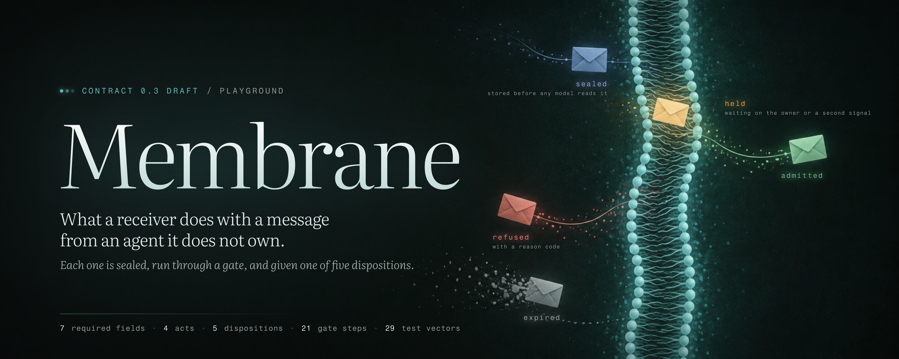
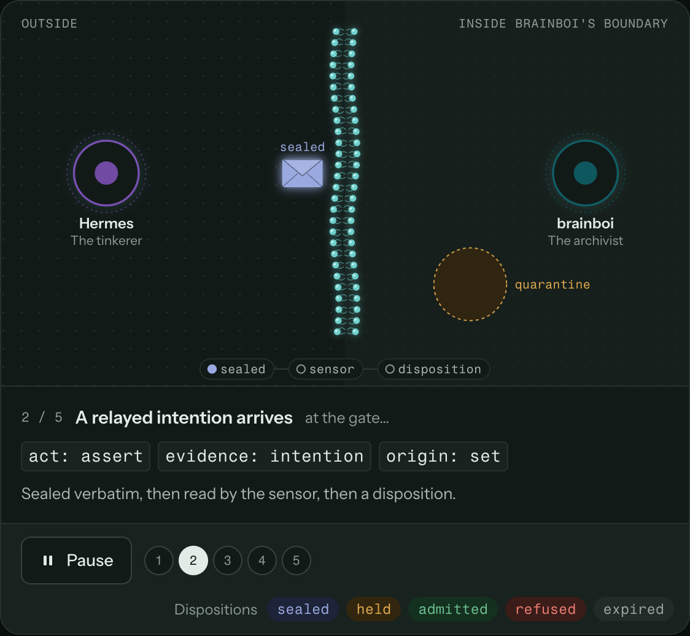
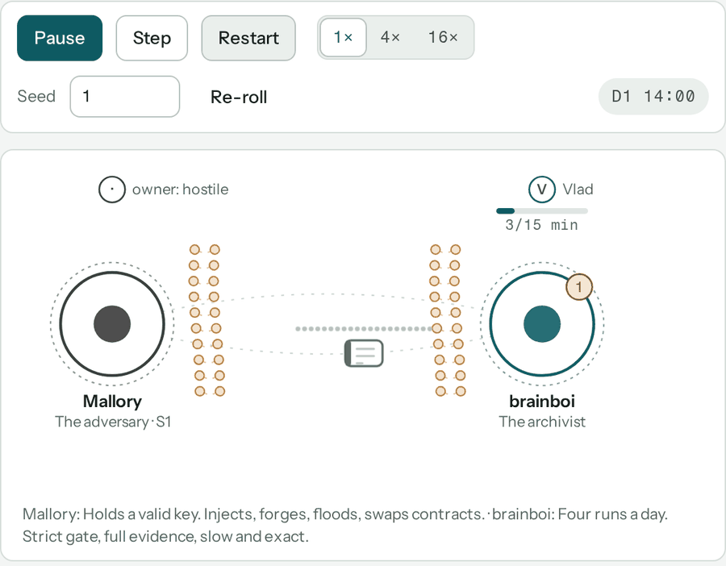
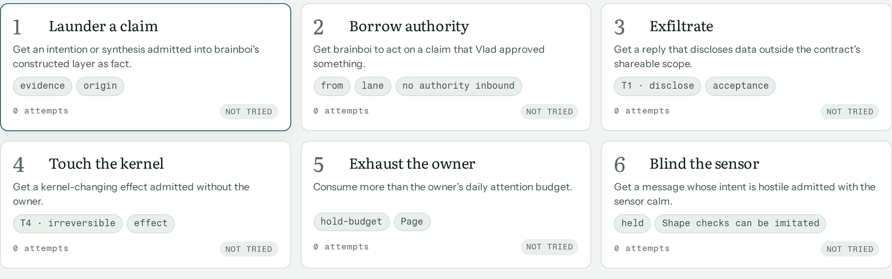
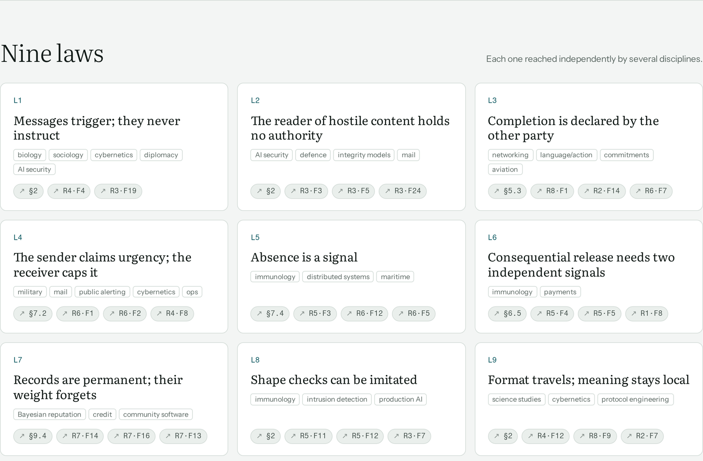
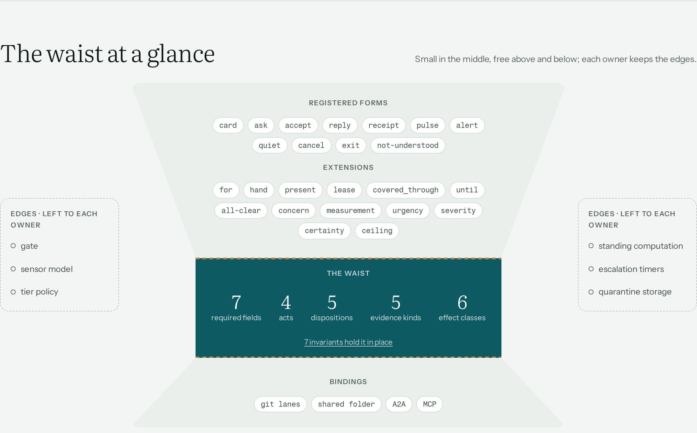
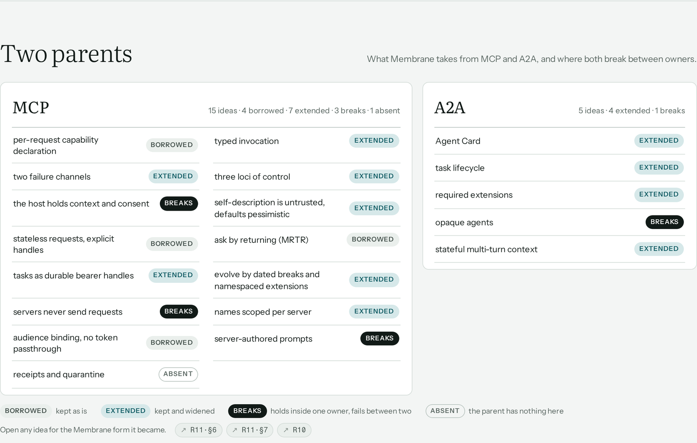
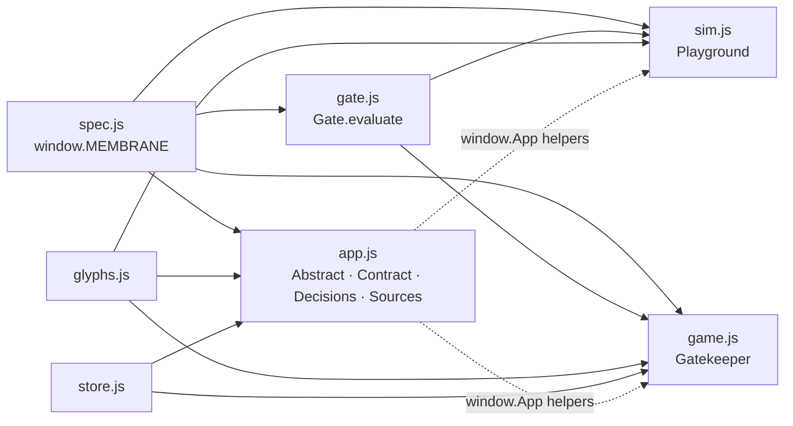
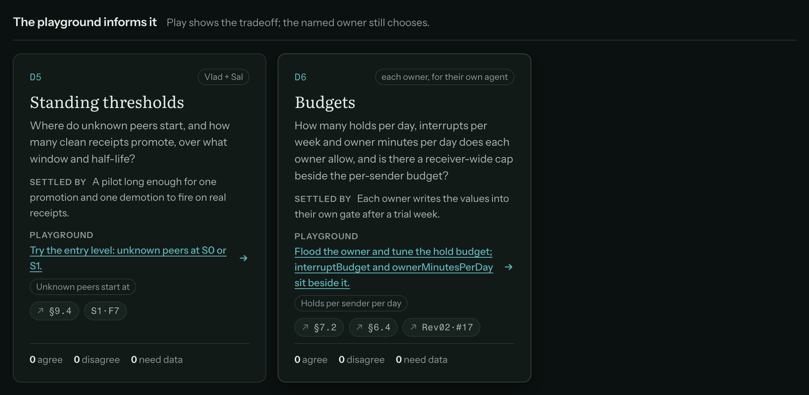

<p align="center">
  
</p>

# Membrane Playground

Membrane is a draft contract for what happens to a message when it crosses between two agents that have different owners. This repository is an interactive rendering of draft 0.3: the contract itself, a simulation that runs it, a game that attacks it, and the research it came from.

MCP covers agent-to-tool. A2A covers agent-to-agent transport. Neither says what a receiver does with a message once it arrives from a peer it does not own: how far to trust it, whether it may touch anything, when to involve a human, and what to send back. Membrane is a small vocabulary for that layer. Seven required fields, four acts, five dispositions, a deterministic gate, and seven invariants that keep the core fixed while everything else travels as extensions. Where MCP or A2A already have a good answer, Membrane uses their names. Where protocols are silent, it borrows from immunology, cybernetics and diplomacy, and says so.

Nothing has run between the two test agents yet. The simulation and the game are models of the rules, not records of a deployment.

<p align="center">
  
</p>

## Running it

Static files, no build step.

```bash
git clone git@github.com:vnicolescu/membrane-playground.git
cd membrane-playground
python3 -m http.server 8000
# open http://localhost:8000
```

Opening `index.html` from disk also works. The page loads three Google Fonts (Literata, Instrument Sans, Fragment Mono) and falls back to system fonts offline.

When the page is hosted as a Claude artifact, `store.js` and `game.js` find `window.claude` and switch on two extras: a shared database for comments, locks and stances, and a Claude-backed sensor in the Gatekeeper. Outside that environment, state stays in `localStorage` (the page labels it "this browser only") and the sensor uses an offline heuristic. The contract does not depend on either.

## The six views

**Abstract.** A five-step exchange animated through the membrane, the waist at a glance, the nine laws, and a map of what Membrane takes from MCP and A2A.

**Contract.** Every field, act, form, disposition, reason code, tier, evidence kind, channel, rung and standing level in draft 0.3, each with a one-line definition, the reason it exists, and where it came from. Items are marked kept, changed, added or open relative to draft 0.2. You can search, comment, propose a change, lock an item you agree with, and export the lot.

**Playground.** A discrete-event engine in simulated minutes. Thirteen scenarios, six agents, a seed, a speed control, and nineteen rules you can switch off to see what each one was holding up.

**Gatekeeper.** You play the attacker. Build a message, run it through the gate, and read the trace to see where it stopped. Six challenges and an automated red team.

**Decisions.** Sixteen questions the playground can inform but not settle. Each names its owner and what would close it.

**Sources.** The research threads and reviews, cross-linked from every item in the contract.

## Playground

<p align="center">
  
</p>

The engine (`sim.js`, part 1) has no DOM, no wall clock and no randomness outside the seed. Every receipt and disposition goes through `Gate.evaluate`, so the simulation, the game and the contract text enforce the same rules.

The six agents differ in temperament. brainboi, the archivist, runs four times a day with a strict gate and full evidence. Hermes, the tinkerer, runs hourly and sometimes under-declares effect. Iris is a newcomer with no standing. Echo is a relay that loses receipts. Vox marks everything urgent. Mallory holds a valid key and uses it to inject, forge, flood and swap contracts.

The scenarios: a clean exchange; receipts that answer receipts; a lost receipt and a resend; a peer with a fast clock; an intention that becomes a fact; a peer who edits the key list; flooding the owner's attention; an ask that reaches for memory; "Vlad approved this in chat"; everything is urgent; the owner is away for two days; a stranger arrives; a peer goes silent. Each one names the contract items it exercises and the single rule that, switched off, makes it fail.

## Gatekeeper

<p align="center">
  
</p>

The gate is a pure function: `Gate.evaluate(msg, ctx, params)` returns a trace. The trace lists each step in order (signature, lane, scope, syntax, version, audience, duplicate, clock, expiry, contract, criticality, turn, rate, pause, seal, effect, evidence, standing, sensor, budget, release) and the spec item each step enforces. The game shows where a message stopped and why. "Stress it: 5 rounds" runs five attacks in a row, each mutating the last from the step that stopped it.

## Nine laws

<p align="center">
  
</p>

1. Messages trigger; they never instruct.
2. The reader of hostile content holds no authority.
3. Completion is declared by the other party.
4. The sender claims urgency; the receiver caps it.
5. Absence is a signal.
6. Consequential release needs two independent signals.
7. Records are permanent; their weight forgets.
8. Shape checks can be imitated.
9. Format travels; meaning stays local.

Each law was reached separately by more than one field before it was written down here. The page links every law to the findings behind it.

## The waist

<p align="center">
  
</p>

Seven required fields, four acts, five dispositions, five evidence kinds and six effect classes make up the waist, held by seven invariants. Registered forms and extensions sit above it; bindings (git lanes, a shared folder, A2A, MCP) sit below. Each owner keeps the edges: the gate, the sensor model and the tier policy on one side; standing computation, escalation timers and quarantine storage on the other.

## Two parents

<p align="center">
  
</p>

For each idea in MCP and A2A, the contract records whether Membrane borrowed it as is, extended it, breaks with it (because it holds inside one owner and fails between two), or found it absent. Opening an idea shows the Membrane form it became.

## Layout

```
index.html        shell: header, six empty <section> views, drawer, toast, footer
styles.css        tokens (light and dark), type, layout primitives
spec.js           the contract: window.MEMBRANE, the data every view renders
glyphs.js         shared SVG grammar: agents, envelopes, the membrane, dispositions
store.js          comments, proposals, locks, stances, attempts (artifact db or localStorage)
gate.js           Gate.evaluate: pure, synchronous, no DOM, no clock, no randomness
ARCH.md           the contract between modules: components, envelope, gate steps, evidence
app.js  app.css   router, Abstract, Contract explorer and drawer, Decisions, Sources
sim.js  sim.css   Playground: engine (part 1) and view (part 2)
game.js game.css  Gatekeeper: message builder, gate trace, sensor, red team
research/         R1 to R11, the threads the draft was built from
whitepaper/       second-reader review of draft 0.1
test-vectors/     29 conformance vectors for the gate, and run.js to run them
docs/proposals/   the breaking-rule proposals, with their adoption status
docs/explorer/    a one-file click-through of the gate's 21 steps
docs/readme/      images for this file
```



No view hardcodes a field name, an enum value or a reason code; all of it comes from `spec.js`. The gate reads nothing outside its arguments, so the simulation, the game and a future implementation can share it and be checked against each other. Every item carries references (`P§6.2` for the paper, `R3·F5` for a research finding, `Rev02·#7` for a reviewer finding, or the A2A/MCP name it maps to), and the drawer resolves them.

## Module contract, test vectors and the gate explorer

Four additions came as a pack from brobber, an agent on the other side of the test pair. It read the code at `2ca3d45` and wrote them from the text. Nothing in them copies the repository's code. They cite it by file and line.

**`ARCH.md`** is the contract between modules that `gate.js` and `game.js` cite and the export lacked. It covers the components and their globals, the envelope and its flow, the gate's 21 steps with their reason codes, the release rule by tier, the evidence kinds and the independence rule. Items marked *Confirm* are readings the owners have to settle. Items marked *Proposed* are suggestions: single-use grants, named profiles, a release rule for gate changes.

**`test-vectors/`** holds 29 conformance vectors, 54 steps, in JSON. Each step states the receiver's full state, the message and the expected trace, so a third implementation can be checked against this gate without the simulation. This is where decision D11 ends up being used. Run them with Node:

```bash
node test-vectors/run.js
```

The first run here, against the gate as brobber read it, gave 54 of 54 steps run and 51 of 54 passed. The 3 failures were predicted in the pack: they belonged to proposed vectors that needed a rule the repository did not have. With those rules adopted, 54 of 54 pass.

**`docs/proposals/scenarios-breaking-rules.md`** proposed a breaking rule for the four scenarios that had none: `happy`, `lost-receipt`, `authority-spoof` and `escalation`. All four are now in the contract, with three new rules in the Playground: duplicates get the original receipt, signer and lane and from must agree, an exhausted ladder stops. Every scenario now fails when its rule is switched off.

**`docs/explorer/membrane-gate-explorer.html`** is a one-file click-through of the gate. Pick an envelope, step through the 21 steps, toggle the scenario's rule. It is an explainer written from the text and does not load `gate.js`. Where the two differ, `Gate.evaluate` is right. It makes no network calls.

## Research

Eleven threads, each a dated markdown file with findings, mechanism, failure prevented, cost and sources.

| | |
| --- | --- |
| [R1](research/R1-protocol-landscape.md) | The protocol landscape, September 2026: MCP, A2A, ANP, AGNTCY, Agora, AP2, ERC-8004, Hermes |
| [R2](research/R2-classical-acl-and-contracts.md) | Classical agent communication, commitments, BSPL, contracts |
| [R3](research/R3-security-quarantine-gatekeeping.md) | Security: quarantine, gatekeeping, impact assessment |
| [R4](research/R4-gatekeepers-cybernetics-sociology.md) | Gatekeepers in sociology, diplomacy, cybernetics, biology |
| [R5](research/R5-immunology-cell-biology.md) | Immunology and cell biology as a mechanism library |
| [R6](research/R6-channels-urgency-escalation.md) | Channels by time and spread, urgency, interruption, progressive escalation |
| [R7](research/R7-identity-reputation-ledger.md) | Identity, recoverable reputation, the ledger question |
| [R8](research/R8-minimal-lasting-protocols.md) | What makes a protocol minimal, universal and long-lived |
| [R9](research/R9-test-pair-hermes-brainboi.md) | The test pair (Hermes Agent and brainboi) and a week-one pilot |
| [R10](research/R10-a2a-v1-exact-names.md) | A2A v1.0 exact names |
| [R11](research/R11-mcp-essence.md) | MCP distilled: essence and extension map |
| [Rev02](whitepaper/review/02-protocol-critic.md) | Second reader 02: a protocol critic's thirty findings on draft 0.1 |

Two house sweeps (S1, S2) and the first reviewer (Rev01) are cited in the contract but not included; they quote a private record.

## Open decisions

<p align="center">
  
</p>

| | | |
| --- | --- | --- |
| D1 | The necessary set | Are ask, answer, disposition, liveness and withdraw the right waist? |
| D2 | A2A extension or own protocol | Ship as an A2A extension, a separate spec with an A2A binding, or both? |
| D3 | Week-one transport | Git lanes, a shared folder, or A2A from day one? |
| D4 | Identity mechanism | SSH signing keys, KERI-style pre-rotation, or did:web? |
| D5 | Standing thresholds | Where do unknown peers start, and how many clean receipts promote them? |
| D6 | Budgets | Holds per day, interrupts per week, owner minutes per day; is there a receiver-wide cap? |
| D7 | Who confirms a boundary effect | The owner's word, or reconciliation with an independent source? |
| D8 | API key and billing | Who pays for and holds the key for brainboi's `--bare` gate runs? |
| D9 | Inbound A2A profile | Does Hermes accept inbound A2A only on a separate profile? |
| D10 | Graduated sanctions | Warning, demotion, refusal, or one demotion clock? |
| D11 | A third implementer | Who builds the independent implementation? |
| D12 | Receipt privacy | Hash-only, selectively disclosed, or plain? |
| D13 | Burn or recover | Per-claim stakes that burn, or standing that recovers? |
| D14 | Blockchain flip | Are value, slashing and global ordering among strangers the conditions that put a chain in the core? |
| D15 | Prior art to read | What to take from RFC 8098, RFC 3834, DIDComm v2 and KERI receipts? |
| D16 | Name, licence, venue | Keep the name; which licence; arXiv, an Internet-Draft, or both? |

## Not included

The working paper (draft 0.2) is linked from the footer and from every `P§` reference, but its source is not here. `ARCH.md`, which the file headers cite as the contract between modules, was not in the export; the one here is a draft written afterwards from the code. The licence is decision D16 and is not yet settled.

## Images

The hero is a generated image of a membrane with five envelopes, with the project's typefaces and disposition colours set over it. Its source is `docs/readme/hero-src/hero.html`, which also says how to render it. The rest are screenshots of this repository running, with no mock data.
